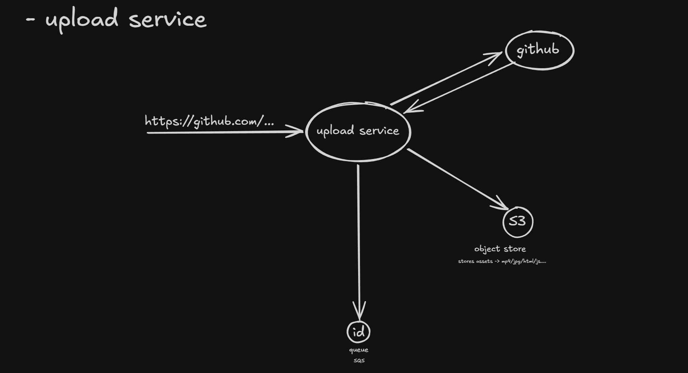
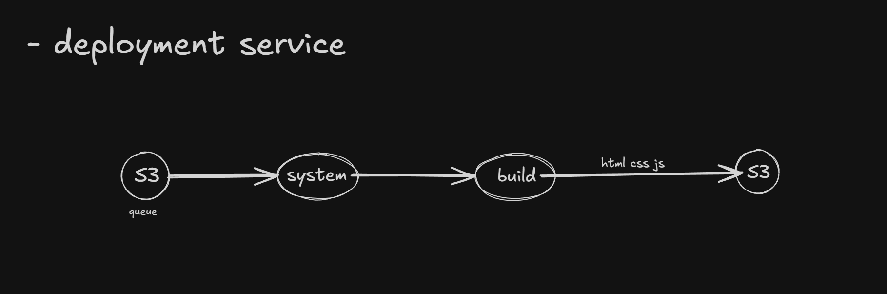
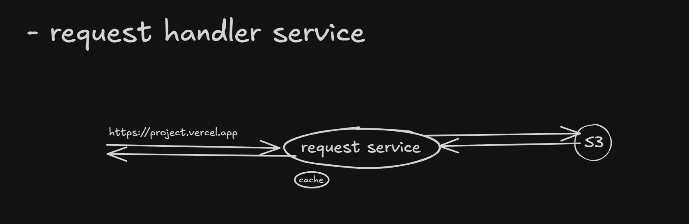

# Vercel Clone (React + Next.js Focus)

This repository is my attempt to build a **Vercel clone only for React and Next.js projects**.

It is split into 3 services:

- `upload-service`: accepts a GitHub repo URL, uploads project files to S3, and pushes a build job ID to Redis.
- `deploment-service`: worker that picks IDs from Redis, builds the project, and uploads final build output back to S3.
- `request-handler-service`: serves built assets from S3 based on subdomain/project ID.

## Architecture Images Used While Building

### 1) Upload Service Architecture



### 2) Deployment Service Architecture



### 3) Request Handler Service Architecture



## Prerequisites

- Node.js + npm
- Redis
- AWS S3 bucket and credentials

## How To Run (Redis First, Then All Services)

### 1) Install Redis and start Redis server

Start Redis first:

```bash
redis-server
```

Keep this terminal running.

### 2) Install dependencies in each service folder

```bash
cd upload-service
npm install

cd ../deploment-service
npm install

cd ../request-handler-service
npm install
```

### 3) Add environment variables

Create `.env` files in each service folder.

`upload-service/.env`

```env
AWS_ACCESS_KEY_ID=your_access_key
AWS_SECRET_ACCESS_KEY=your_secret_key
S3_BUCKET_NAME=your_bucket_name
S3_BUCKET_REGION=your_bucket_region
```

`deploment-service/.env`

```env
AWS_ACCESS_KEY_ID=your_access_key
AWS_SECRET_ACCESS_KEY=your_secret_key
S3_BUCKET_NAME=your_bucket_name
S3_BUCKET_REGION=your_bucket_region
```

`request-handler-service/.env`

```env
AWS_ACCESS_KEY_ID=your_access_key
AWS_SECRET_ACCESS_KEY=your_secret_key
S3_BUCKET_NAME=your_bucket_name
S3_BUCKET_REGION=your_bucket_region
```

### 4) Start all services (separate terminals)

Terminal 1:

```bash
cd upload-service
npm start
```

Terminal 2:

```bash
cd deploment-service
npm start
```

Terminal 3:

```bash
cd request-handler-service
npm start
```

## Run With Docker Compose

### 1) Install Docker

Install Docker Desktop (Docker Compose is included).

### 2) Create env files

Create these files from examples and fill your values:

- `upload-service/.env` from `upload-service/.env.example`
- `request-handler-service/.env` from `request-handler-service/.env.example`
- `deployment-service/.env` from `deployment-service/.env.example`
- `nextjs-frontend/.env.local` from `nextjs-frontend/.env.example`

### 3) Start all services using Docker Compose

From project root:

```bash
docker compose up -d
```

Frontend will be available at `http://localhost:3002`.

### 4) Stop services

```bash
docker compose down
```

## Service Ports

- `upload-service`: `http://localhost:3000`
- `request-handler-service`: `http://localhost:3001`
- `deploment-service`: background worker (no HTTP port)

## Notes

- The build worker currently uploads files from `dist/`, so repository build output should be available there.
- `request-handler-service` resolves project ID from subdomain and fetches files from S3 (`dist/{id}/...`).
